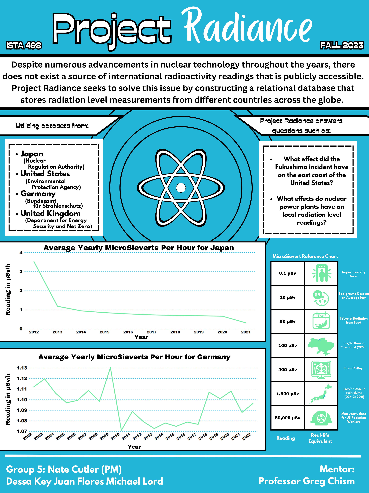
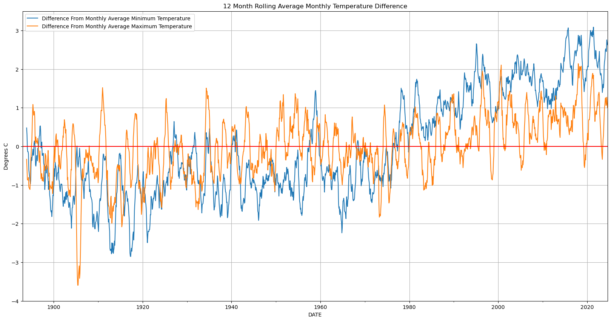
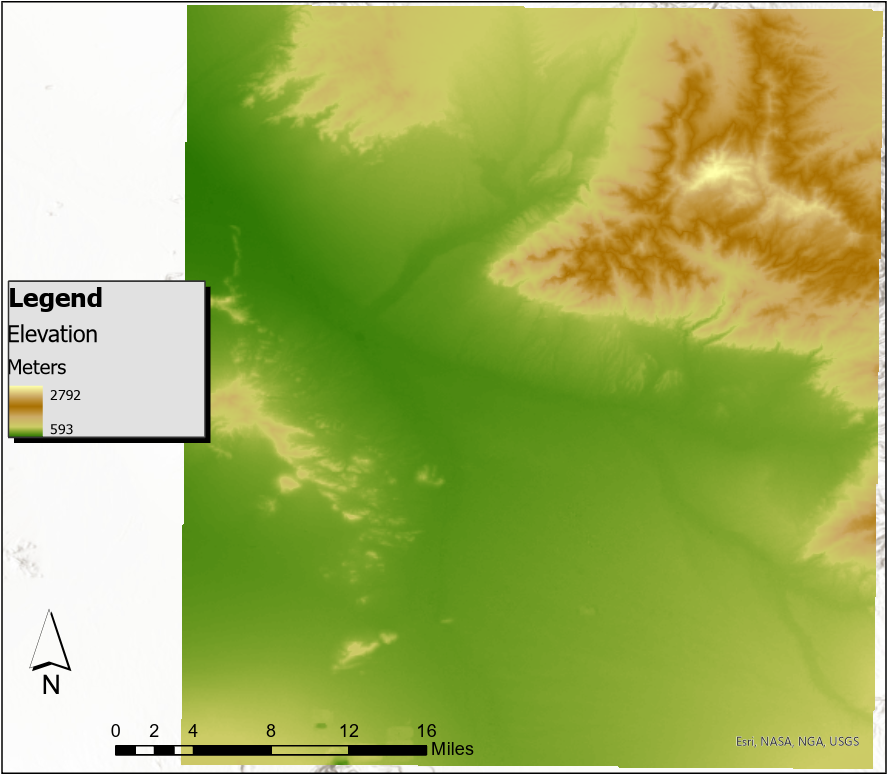
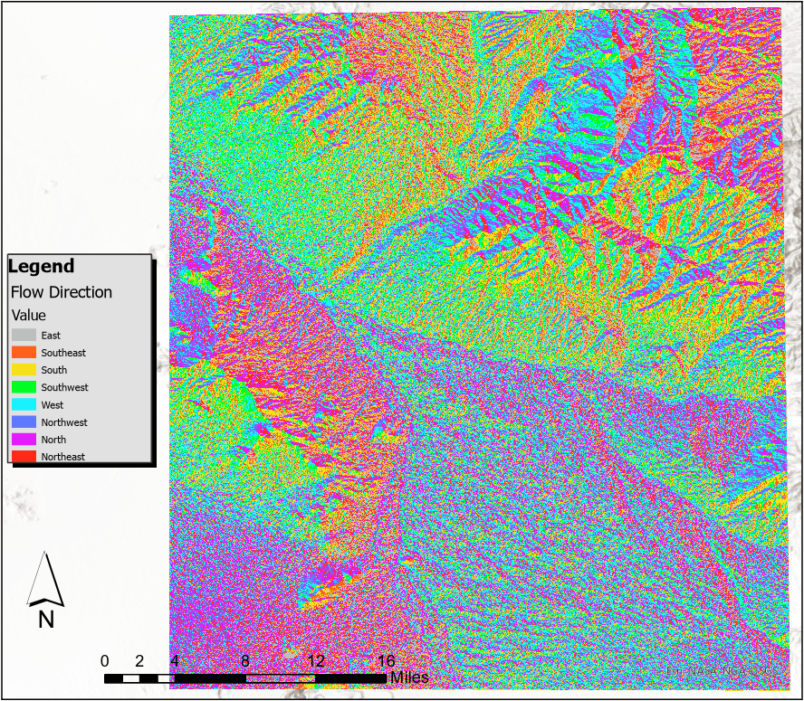
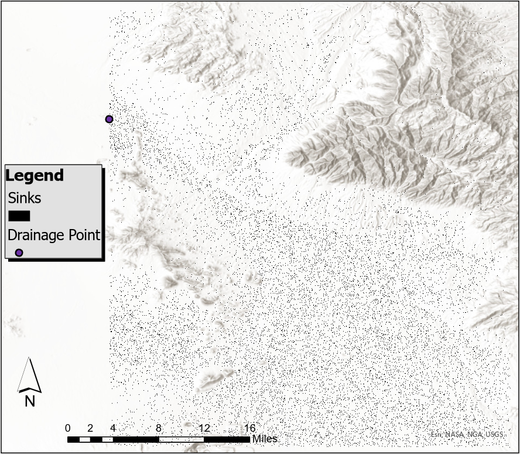
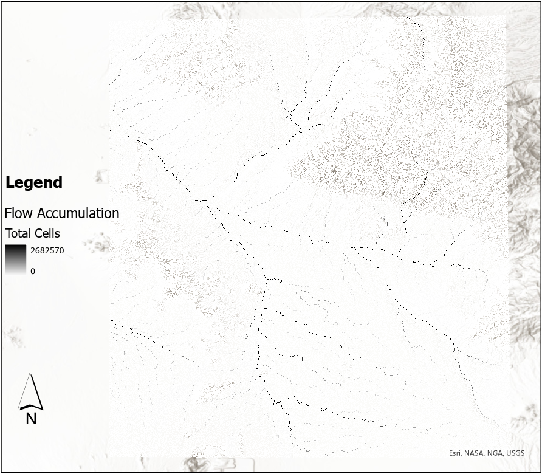
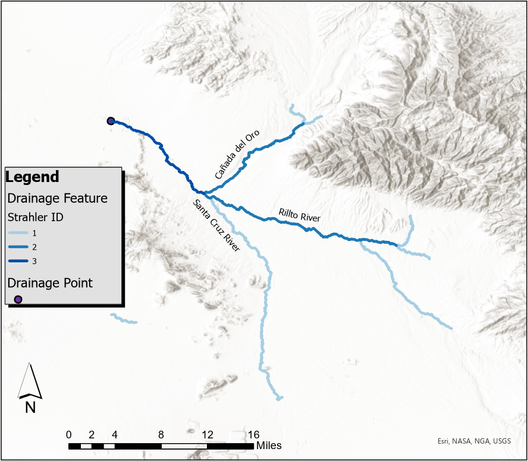
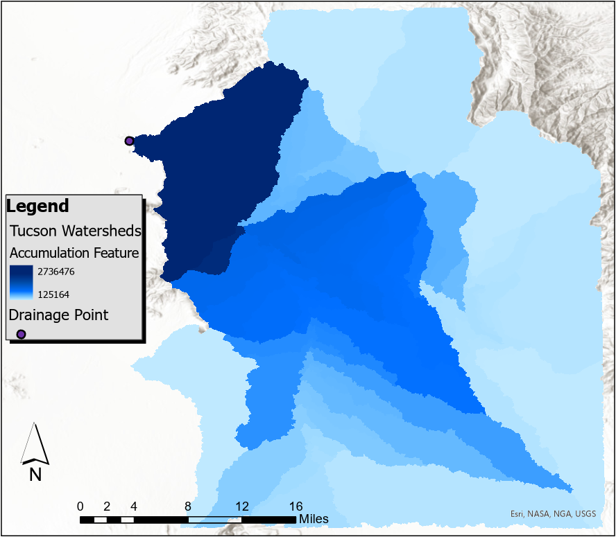
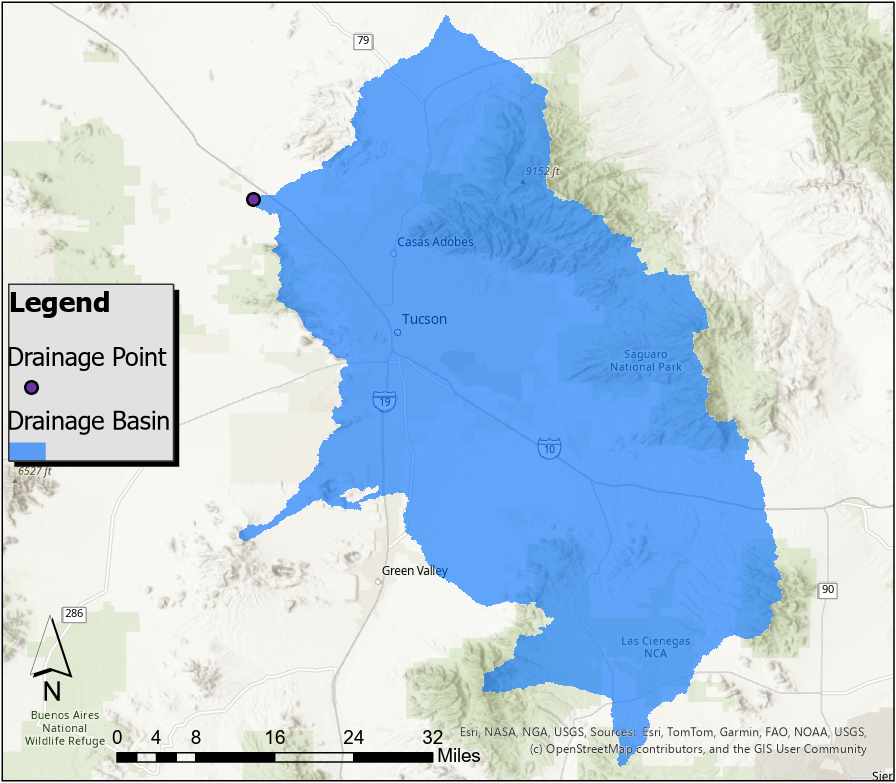
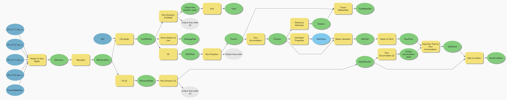

# ISTA498-Capstone

[**Project Radiance: Group Capstone Project for the University of Arizona ISTA 498**]{style="font-size: 24px;"}  \
[**Team Members:**]{style="font-size: 20px;"}

-   Nate Cutler (Project Manager, [Germany](https://github.com/dessak/ISTA498-Capstone/tree/main/src/tools/germany), [PowerBI Visualizations](https://github.com/dessak/ISTA498-Capstone/tree/main/src/vizualizations))

-   Dessa Keys ([US](https://github.com/dessak/ISTA498-Capstone/tree/main/US), [Tableau Dashboard](https://public.tableau.com/app/profile/dessa2111/viz/ProjectRadiance/Map))

-   Juan Flores ([Japan](https://github.com/dessak/ISTA498-Capstone/tree/main/src/tools/japan), [Poster Design](https://github.com/dessak/ISTA498-Capstone/blob/main/src/vizualizations/ISTA_498_Group_5_Final_Poster.png))

-   Michael Lord ([UK](https://github.com/dessak/ISTA498-Capstone/tree/main/UK))

This project was conceptualized by Nate Cutler as the capstone project for the team and presented in December 2023. It is intended to highlight various skills learned for the Information Science degree from the University of Arizona's iSchool and therefore employs various methods and languages.

Data Sources

-   US: Environmental Protection Agency's RadNet

-   Germany: Bundesamt fur Strahlenschutz

-   Japan: Database for Radioactive Substance Monitoring Data

-   UK: Department for Energy Security and Net Zero

[Project Poster]{style="font-size: 24px;"}

# Tucson Weather
[**Analysing Historic Tucson Weather Data**]{style="font-size: 24px;"}  
 
[This repository](https://github.com/dessak/TucsonWeather/tree/main) contains various explorations of historic weather data for Tucson, Arizona pulled from NOAA's Climate Data Online (CDO)

[**Relevant Links**]{style="font-size: 24px;"}  
  
Data Source:  
[https://www.ncei.noaa.gov/access/services/data/v1](https://www.ncei.noaa.gov/access/services/data/v1) (HTTP 1.1 GET request endpoint)

Request Endpoint Parameters:  
[https://www.ncei.noaa.gov/support/access-data-service-api-user-documentation](https://www.ncei.noaa.gov/support/access-data-service-api-user-documentation)

[**Station List:**]{style="font-size: 24px;"}  
  
        'US1AZPM0003', 'US1AZPM0004', 'US1AZPM0005', 'US1AZPM0007', 'US1AZPM0010', 'US1AZPM0014', 'US1AZPM0019',
        'US1AZPM0024', 'US1AZPM0031', 'US1AZPM0044', 'US1AZPM0050', 'US1AZPM0051', 'US1AZPM0054', 'US1AZPM0072',
        'US1AZPM0082', 'US1AZPM0087', 'US1AZPM0093', 'US1AZPM0099', 'US1AZPM0103', 'US1AZPM0104', 'US1AZPM0106',
        'US1AZPM0107', 'US1AZPM0108', 'US1AZPM0111', 'US1AZPM0114', 'US1AZPM0118', 'US1AZPM0119', 'US1AZPM0122',
        'US1AZPM0124', 'US1AZPM0125', 'US1AZPM0132', 'US1AZPM0135', 'US1AZPM0142', 'US1AZPM0143', 'US1AZPM0145',
        'US1AZPM0146', 'US1AZPM0147', 'US1AZPM0148', 'US1AZPM0149', 'US1AZPM0156', 'US1AZPM0160', 'US1AZPM0173',
        'US1AZPM0174', 'US1AZPM0181', 'US1AZPM0184', 'US1AZPM0193', 'US1AZPM0198', 'US1AZPM0199', 'US1AZPM0201',
        'US1AZPM0202', 'US1AZPM0206', 'US1AZPM0208', 'US1AZPM0210', 'US1AZPM0214', 'US1AZPM0215', 'US1AZPM0218',
        'US1AZPM0229', 'US1AZPM0233', 'US1AZPM0244', 'US1AZPM0245', 'US1AZPM0247', 'US1AZPM0248', 'US1AZPM0249',
        'US1AZPM0254', 'US1AZPM0261', 'US1AZPM0263', 'US1AZPM0265', 'US1AZPM0268', 'US1AZPM0273', 'US1AZPM0292',
        'US1AZPM0294', 'US1AZPM0301', 'US1AZPM0304', 'US1AZPM0306', 'US1AZPM0315', 'US1AZPM0321', 'US1AZPM0328',
        'US1AZPM0336', 'US1AZPM0338', 'US1AZPM0339', 'US1AZPM0340', 'US1AZPM0355', 'US1AZPM0356', 'US1AZPM0362',
        'US1AZPM0363', 'US1AZPM0366', 'US1AZPM0370', 'US1AZPM0371', 'US1AZPM0373', 'US1AZPM0374', 'US1AZPM0379',
        'US1AZPM0384', 'US1AZPM0386', 'US1AZPM0391', 'US1AZPM0399', 'US1AZPM0405', 'US1AZPM0409', 'US1AZPM0411',
        'US1AZPM0412', 'US1AZPM0415', 'US1AZPM0416', 'US1AZPM0422', 'US1AZPM0424', 'US1AZPM0426', 'US1AZPM0427',
        'US1AZPM0433', 'US1AZPM0436', 'US1AZPM0441', 'US1AZPM0442', 'US1AZPM0443', 'US1AZPM0446', 'US1AZPM0449',
        'US1AZPM0450', 'US1AZPM0460', 'US1AZPM0463', 'US1AZPM0470', 'USC00028795', 'USC00028796', 'USC00028799',
        'USC00028800', 'USC00028810', 'USC00028815', 'USC00028817', 'USW00023160', 'USW00053131'

[**Parameters Included in Request:**]{style="font-size: 24px;"}  
  
        'ACMH', 'ACSH', 'ADPT', 'ASLP', 'ASTP', 'AWBT', 'AWND', 'DAEV', 'DAPR', 'DAWM', 'EVAP', 'FMTM', 'FRGT',
        'MDEV', 'MDPR', 'MDWM', 'MNPN', 'MXPN', 'PGTM', 'PRCP', 'PSUN', 'RHAV', 'RHMN', 'RHMX', 'SNOW', 'SNWD',
        'TAVG', 'THIC', 'TMAX', 'TMIN', 'TOBS', 'TSUN', 'WDF1', 'WDF2', 'WDF5', 'WDFG', 'WDFM', 'WDMV', 'WESD',
        'WESF', 'WSF1', 'WSF2', 'WSF5', 'WSFG', 'WSFM', 'WT01', 'WT02', 'WT03', 'WT04', 'WT05', 'WT06', 'WT07',
        'WT08', 'WT09', 'WT10', 'WT11', 'WT13', 'WT14', 'WT16', 'WT18', 'WT19', 'WT21', 'WT22', 'WV03'

[**Tucson Historical Maximum and Minimum Temperature Differences From Average**]{style="font-size: 20px;"}

# Tucson Watersheds
[**Analysing Tucson's Watersheds & Drainage Basin**]{style="font-size: 24px;"}

This project was created to visualize the drainage features of the Tucson area. Of special interest are the contributing features to the drainage point in the Santa Cruz River northwest of the Tucson. Shuttle Radar Topography Mission (SRTM) information was obtained from the USGS Earth Explorer for this process. Four images were merged to cover the appropriate area.

[**Elevation of Tucson Area**]{style="font-size: 18px;"}

After SRTM rasters were merged, they were clipped to the area of interest to create a Digital Elevation Model (DEM) of the Tucson area.

{.lightbox fig-align="center"}

[**Flow Direction**]{style="font-size: 18px;"}

After establishing a DEM, flow direction can be determined.

{.lightbox fig-align="center"}

[**Sinks**]{style="font-size: 18px;"}

Flow direction can then be used to identify sinks. These sinks must be filled to determine drainage featers.

{.lightbox fig-align="center"}

[**Flow Accumulation**]{style="font-size: 18px;"}

Since the sinks are now filled, flow direction is redetermined and then used to calculate flow accumulation.
{.lightbox fig-align="center"}

[**Drainage Features**]{style="font-size: 18px;"}

In a seperate process, using just the original DEM, drainage features can be determined. The Sthalar method was used for this step to determine drainage feature order. This allows for better visualization of the major drainage features than can be seen in the flow accumulation raster.

{.lightbox fig-align="center"}

[**Tucson Area Watersheds**]{style="font-size: 18px;"}

Using the flow accumulation, the watersheds for the Tucson area are then calculated.

{.lightbox fig-align="center"}

[**Complete Drainage Basin**]{style="font-size: 18px;"}

While the original intent was to visualize the watershed in the Tucson area, the watersheds of the drainage point extend beyond the area of interest. Using the original merged SRTM DEM, the calculation can be used again to capture the entire drainage basin for the drainage point using a smaller scale.

{.lightbox fig-align="center"}

[**ArcGIS Pro Model**]{style="font-size: 18px;"}

The below model represents the workflow without the separate process of determining drainage features.

{.lightbox fig-align="center"}

[**Sources**]{style="font-size: 18px;"}

U.S. Geological Survey. (2000). Shuttle Radar Topography Mission (SRTM) 1 Arc-Second Global. Retrieved July 1, 2025, from USGS EarthExplorer: https://earthexplorer.usgs.gov/

Esri. (2025). World Topographic Map [Basemap]. Sources: Esri, HERE, Garmin, FAO, NOAA, USGS, © OpenStreetMap contributors, and the GIS user community. Retrieved from https://www.arcgis.com