# Vector Analysis

::: {.panel-tabset}

### Queries & Joins

```{=html}
<h2 style="margin-top:1em;">Title of Analysis</h2>
```

```{=html}
<h3 style="margin-top:1em;">Questions</h3>
```
Define eight questions that include the following:  
  
Attribute Query
What Census block in tucson has the densist population?
  

two questions that can be answered using Attribute queries  

SPatial Query
two questions that can be answered using Spatial queries  

Spatial Join
What Ward has the largest population?
What ward has the largest hispanic population
    
two questions that can be answered using a combination of attribute and spatial queries as well as spatial joins  

```{=html}
<h3 style="margin-top:1em;">Data</h3>
```


Describe your study area in 3 - 5 sentences to provide a frame of reference.  
Describe your data in 2 - 3 sentences.  
Include a map of your study area showing your data.  

```{=html}
<h3 style="margin-top:1em;">Methods</h3>
```


What projection did you use for your data? Describe why? (1 paragraph, <100 words)  
Attribute Queries  
Describe all the steps taken to answer your questions. (1 paragraph, <100 words)   
Spatial Queries  
Describe all the steps taken to answer your questions. (1 paragraph, <100 words)  
Spatial Joins  
Describe all the steps taken to answer your questions. (1 paragraph, <100 words)  
Combination  
Describe all the steps taken to answer your questions. (1 paragraph, <100 words)   
State your assumptions and explain why. (1 - 2 paragraphs, <200 words)  

```{=html}
<h3 style="margin-top:1em;">Results</h3>
```


Attribute Queries  
Describe your results. (1-2 paragraph, <200 words)  
Include any tables or maps that help explain your results.  
Spatial Queries  
Describe your results. (1-2 paragraph, <200 words)  
Include any tables or maps that help explain your results.  
Spatial Joins  
Describe your results. (1-2 paragraph, <200 words)  
Include any tables or maps that help explain your results.  
Combination  
Describe your results. (1-2 paragraph, <200 words)  
Include any tables or maps that help explain your results.  

```{=html}
<h3 style="margin-top:1em;">Conclusion</h3>
```


Draw conclusions from your analyses as it relates to answering each of your questions. (2 - 3 paragraphs, <500 words)  
Discuss any limitations in your analysis and how they affect your conclusions. (1-2 paragraphs, <200 words)  

```{=html}
<h3 style="margin-top:1em;">References</h3>
```
Include any references or literature that you may cite while working on this analysis.  

### Network Analysis

```{=html}
<h2 style="margin-top:1em;">San Francisco Street Network Analysis</h2>
```

  

```{=html}
<h3 style="margin-top:1em;">Problem Statement</h3>
```

  

Emergency responders have to contend with many issues when organizing their responses including street closures and limited access for special events and construction. These are issues best resolved with network analysis. This analysis seeks to identify changes as a result of limited access on a single day as well as long term planning with the following questions:

  
1. How do street closures on 7/27/25 affect service areas of fire stations?
  
2. Given the street closures, what would be the best route for the Fire Chief to inspect NE quadrant stations?
  
3. Given a set of candidate sites and the current equipment facility site, which candidate site would reduce supply line service times the most?
  

```{=html}
<h3 style="margin-top:1em;">Data</h3>
```

  

The study area for this analysis is the limits of the City and County of San Francisco. San Francisco lies on the northernmost tip 
of the San Francisco Peninsula located on the Northern California coast.

  

The street network feature dataset is from ESRI's ["Optimizing Routes for Efficient Fleet Management"](https://www.esri.com/training/catalog/5a1da3e0e79aee27e8839e8b/optimizing-routes-for-efficient-fleet-management/) tutorial. The ["City Facilities - Fire Department Jurisdiction or Leased"](https://data.sfgov.org/City-Infrastructure/City-Facilities-Fire-Department-Jurisdiction-or-Le/mt4k-j2ju/about_data) table was downloaded from the DataSF | Open Data Portal and then geocoded into a point feature dataset. This feature includes both fire stations as well as other supporting facilities. In addition, the ["Temporary Street Closures Map"](https://data.sfgov.org/Transportation/Temporary-Street-Closures-Map/98cv-qtqk) was exported from DataSF for street closures on 7/27/25.

  

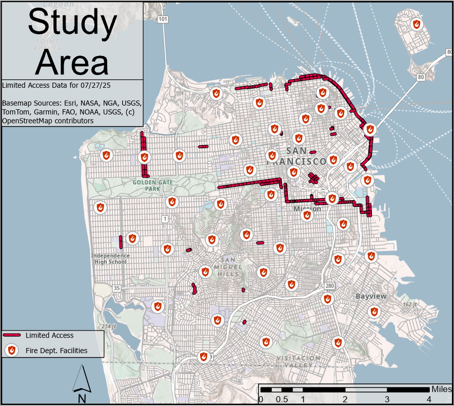{.lightbox}

  

```{=html}
<h3 style="margin-top:1em;">Methods</h3>
```

  

Network analysis requires accurate measures of distance in multiple directions. This would best be accomplished with a conformal projection. This analysis uses the California Zone III State Plane (FIPS 0403) in meters which is a Lambert conformal conic projection. This is where the City and County of San Francisco is located. It uses the most recent update (2011) to the 1983 North American Datum.

  

[**Method #1: Service Areas**]{style="font-size: 18px;"}

  

The service area network analysis type identifies the geographic region that can be reached within a given time or distance. This analysis used a time requirement with breaks at 1, 2, and 3 minutes. Time cutoffs were calculated going away form facilities since we are looking at the response times of emergency vehicles leaving the stations. Polygons were set to split where they meet (Figure 2). In order to calculate the time regions, the network must have speed limit information. Fire stations were added as Facilities Sub Layer (Figure 3) and street access restrictions to the Line Barriers sub layer (Figure 4).

  

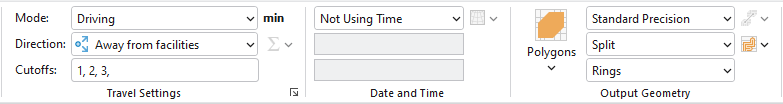{.lightbox}

  

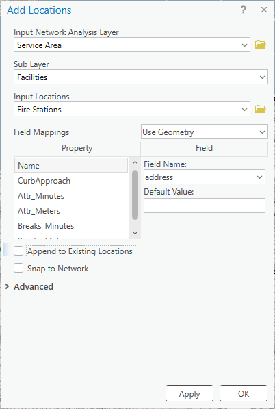{.lightbox}

  

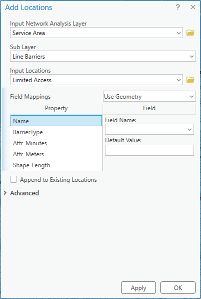{.lightbox}

  

[**Method #2: Best Route**]{style="font-size: 18px;"}

  

The best route network analysis minimizes either distance or time for the route of interest. The analysis accounts for road speed or mode speeds when set to measure the accumulated time. For this analysis, time was minimized. In order to allow for the Chief to start and stop at their residence, the "Preserve First & Last Stop" option was used with the Fire Chief's residence entered once as the first stop and once again as the last stop. (Figure 5) A separate layer was created from a selection of the fire stations in the north east quadrant and then added as stops. (Figure 6). Line barriers were added as in the previous method (Figure 4)

  

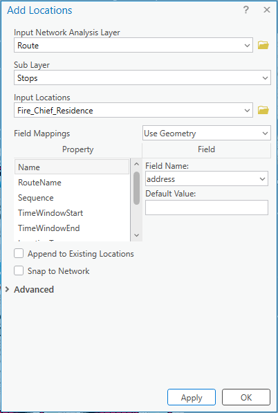{.lightbox}

  

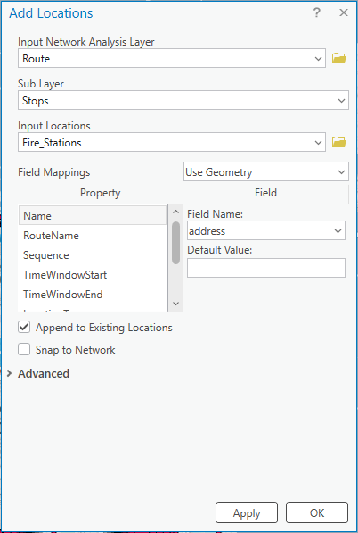{.lightbox}

  

[**Method #3: Optimal Location**]{style="font-size: 18px;"}

  

Optimal Location Analysis identifies the best site(s) for facilities based on criteria such as distance or travel time, demand, and constraints. For this analysis we want to minimize the drive time away from facilities. In order to do this the "Minimize Weighted Impedance" problem type was used (Figure 7). The existing equipment facility was added to the "Facilities" Sub Layer locations. The Default Value of "Required" was selected to insure the analysis included it in its calculations (Figure 8). The candidate sites were selected from areas with acceptable zoning and then also entered in the "Facilities" Sub Layer but with the Default Value of "Candidate". Because we are looking to minimize the time from an equipment facility to a fire station, "Away from facilities" was used for the Direction and 2 for Facilities since we are only looking to add 1 additional facility. (Figure 9)

  

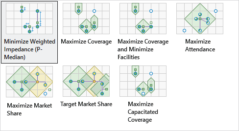{.lightbox}

  

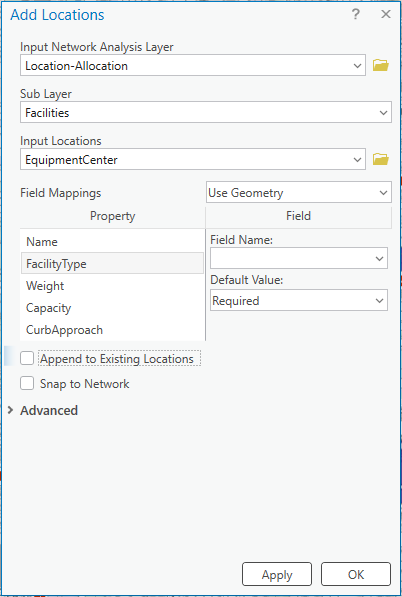{.lightbox}

  

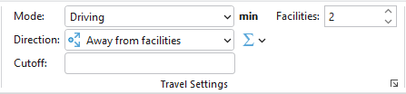{.lightbox}

  

No traffic was included in any of these analyses. This was due to the limited availability of this data as well as its dynamic nature. Drive time was the chosen method for all three analyses as it is more important than distance for emergency services. Drive times were calculated using speed limits, direction of travel, and restricted turns, though emergency vehicles are not necessarily beholden to these constraints.

  

```{=html}
<h3 style="margin-top:1em;">Results</h3>
```

  

[**Service Areas**]{style="font-size: 18px;"}

  

The outcome shows the result of the analysis with the different colored polygons representing areas reached within 1 minute (purple), 2 minutes (green), and 3 minutes (yellow) While most of the limited access is located in the northern half of the city, most areas in the northern half are still within 2 minute service areas. The southern half of the city has significantly more area within the 3 minute service mark including some areas beyond 3 minutes despite having significantly less closures. Upon closer inspection it can be seen that the geography necessitates more dispersed roads that are more likely to wind around hills in addition to the stations being more spatially dispersed.

  

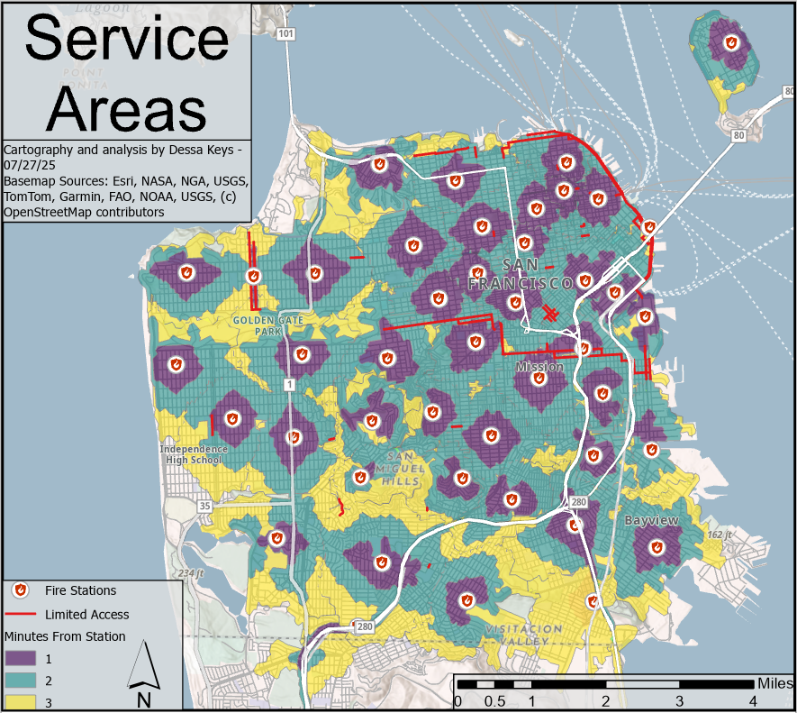{.lightbox fig-align="center"}

  

[**Best Route**]{style="font-size: 18px;"}

  

As a result of the San Francisco Marathon, Station #35 is blocked and will be unreachable on that date. It is therefore not included in the route and will need to be inspected on a different occasion. The remaining ten stations only have to contend with a few minor lengths of limited access. If the chief wants to be able to reach all stations for this round of site inspections, they will have to do so on another date.
  
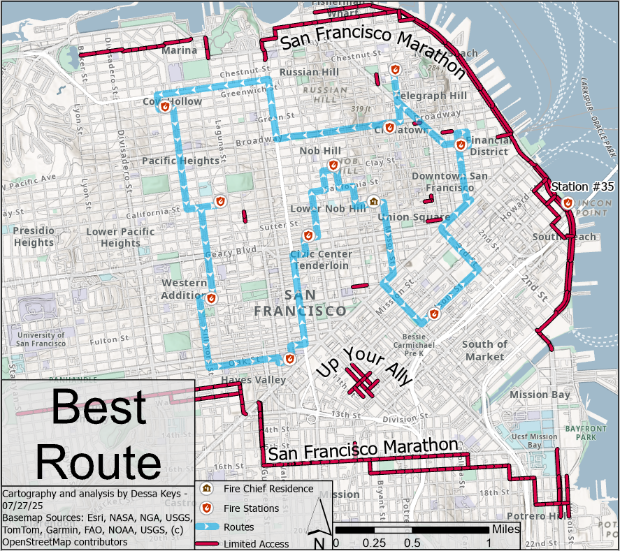{.lightbox fig-align="center"}

  

[**Optimal Location**]{style="font-size: 18px;"}

  

With this optimal location analysis, the newly sited equipment facility becomes the main location servicing the majority of stations. The old facility becomes the closest facility to only 5 stations. A more equal distribution is unfortunately limited by zoning which limited where the candidate sites could be located. There are some stations in the south that appear to be spatially closer to the old facility but the network analysis determined that the new facility would be closer as a function of time. This is most likely due to the selected candidate site's location near a highway.

  

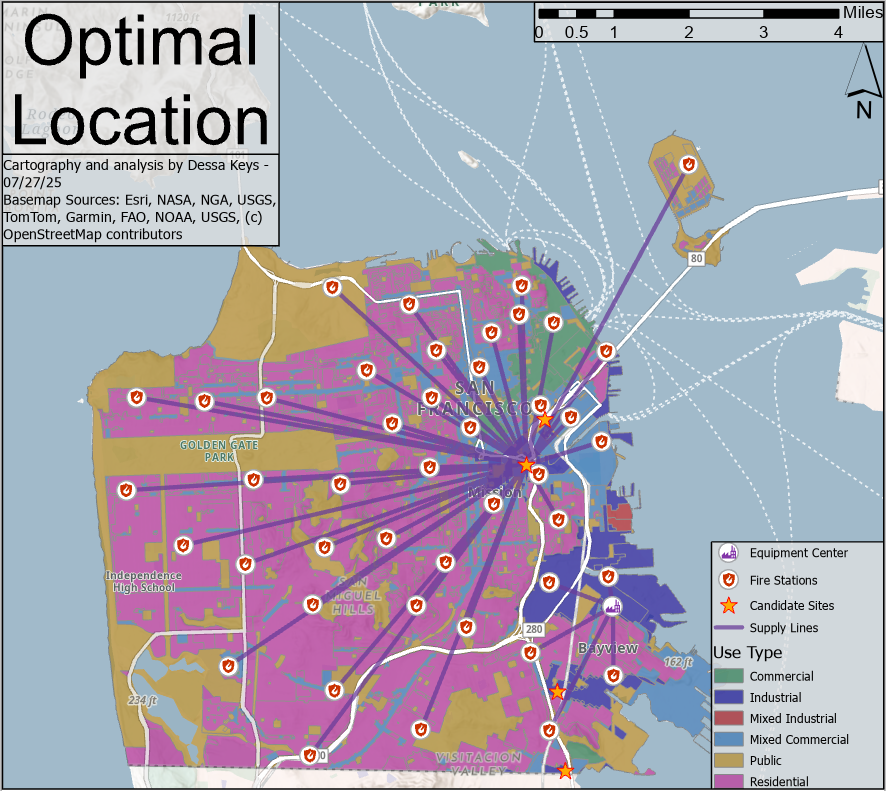{.lightbox fig-align="center"}

  

```{=html}
<h3 style="margin-top:1em;">Conclusion</h3>
```
  
While there were significant street closures for events, disruptions to service were kept to a minimal. This is likely due in part to intentional planning of activities to minimize their impact on emergency services. This is also a benefit of properly distributed stations. Because of the lopsided dependent station counts for the equipment facilities it may be more beneficial to simply move the equipment facility to the new candidate site instead of operating two facilities as the candidate site allows for significantly reduced supply lines. This can be confirmed by running the analysis again with the requirement for only 1 facility.
  
One major limitation to this analysis is that it does not include traffic patterns which can vary depending on time of day or day of the week. The best route analysis and service area analysis would be most affect by this lack of information as the calculations where performed as a function of time and not distance and traffic would affect that outcome. The optimal location analysis would benefit from including average traffic pattern information as it is not attempting to establish the shortest supply lines at a particular point in time but rather on average. Emergency services also are not necessarily beholden to the typical constraints that civilian traffic is limited to and this was not accounted for. This analysis also did not distinguish between complete street closure and limited access. It is possible that access to certain areas and stations is not completely blocked but rather limited in lanes or to emergency vehicles only. Service areas also do not account for the fire boat component of station #35 which is not limited by the street network and can only access buildings on the coast.

  

```{=html}
<h3 style="margin-top:1em;">References</h3>
```
  
“City Facilities - Fire Department Jurisdiction or Leased.” Sfgov.org, 25 July 2025, data.sfgov.org/City-Infrastructure/City-Facilities-Fire-Department-Jurisdiction-or-Le/mt4k-j2ju/about_data. Accessed 27 July 2025.
  
“Optimizing Routes for Efficient Fleet Management.” Esri.com, ESRI, www.esri.com/training/catalog/5a1da3e0e79aee27e8839e8b/optimizing-routes-for-efficient-fleet-management/. Accessed 23 July 2025.
  
“Temporary Street Closures Map | DataSF.” Sfgov.org, 25 July 2025, data.sfgov.org/Transportation/Temporary-Street-Closures-Map/98cv-qtqk. Accessed 27 July 2025.
  

### Suitability Analysis

```{=html}
<h2 style="margin-top:1em;">Siting Optimal Location for High Density Housing</h2>
```

```{=html}
<h3 style="margin-top:1em;">Problem Statement</h3>
```

Like much of the rest of the nation, Tucson is suffering from a housing shortage. Tucson also suffers from low density with "high-density housing only allowed on 12 percent of properties in the city under current regulations" (Robbins) Tucson has been in the process of implementing multiple plans in an attempt to facilitate the development of infill and higher density housing including modifying zoning to allow for easier development of mixed use high density housing as in the [Community Corridors Tool](https://corridors.tucsonaz.gov/). In an effort to provide convenience to residents this analysis seeks to find suitable locations for high-density housing that;
  
1. Develops a currently low density area
  
2. Is located close to a bus stop to promote the use of public transportation
  
3. Is located near a grocery store or market.
  

```{=html}
<h3 style="margin-top:1em;">Data</h3>
```

  

This study focuses on the area within the current city limits of Tucson, Arizona. Tucson is situated in eastern Pima County in the southern part of the State of Arizona. Tucson serves as the county seat and is the core of the second largest metro area in the state. 
  

  
There are four datasets used for this analysis. The [grocery stores dataset](https://www.arcgis.com/home/item.html?id=e3416eeb1f1a47728a0adae4b3186b4f) was accessed from the ArcGIS Online Portal and modified to remove delis and carnicerias that did not include markets in their stores. The [public transportation stops](https://www.arcgis.com/home/item.html?id=0f9ec9e1308b48dba95c30872ea164ea#overview) dataset was also accessed through the ArcGIS Portal. The [zoning dataset](https://gisdata.tucsonaz.gov/datasets/cotgis::original-city-zoning-open-data/about) was accessed from the Tucson Open Data website. [Census data](https://www.arcgis.com/home/item.html?id=d795eaa6ee7a40bdb2efeb2d001bf823) was also accessed from the ArcGIS Online Portal and clipped to city limits.

  
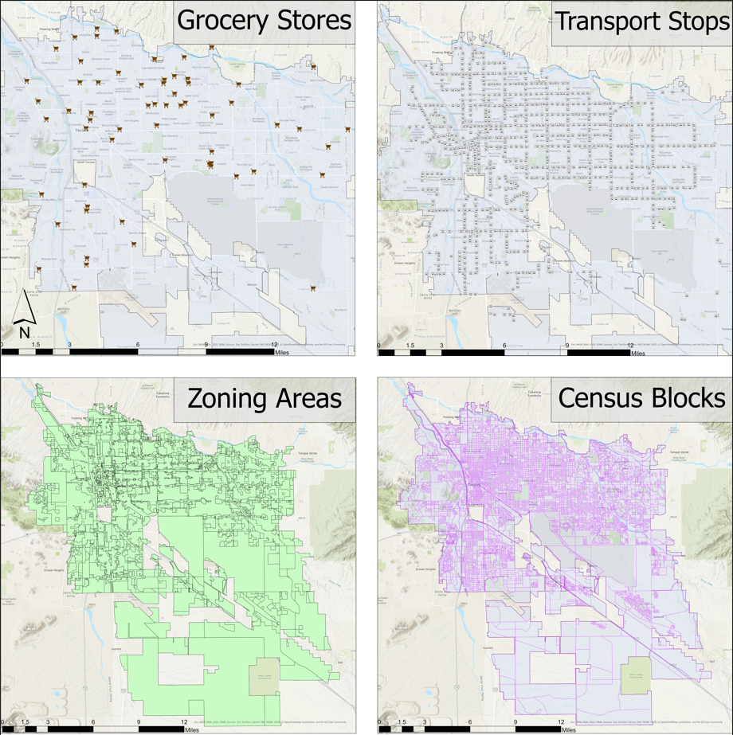{.lightbox fig-align="center"}

  

```{=html}
<h3 style="margin-top:1em;">Methods</h3>
```

  

This analysis used the Arizona Central State Plane (Meters) projection which is a Transverse Mercator projection. Since the Transverse Mercator is conformal it is ideal for calculations that involve distance in multiple directions as in this analysis. The datum was the 2011 update to the 1983 North American Datum. Tucson is located within the Arizona Central State Plane projection.

  

The two principle goals for this analysis are to reduce the dependency on individual vehicles as well as develop low density areas. As such, the first requirement is that the selected site be within walking distance of a grocery store. The second requirement is that the development be near a SunTran or Sunlink stop (Public transportation  system). As there are zoning regulations, the site must be in an appropriate zone. Finally, Census data will be used to evaluate population density to select for areas with low density.

  
[**Boolean Method**]{style="font-size: 18px;"}

  
This method uses the Intersect geoprocessing tool in vector analysis. This tool identifies overlapping areas in various layers and is used in boolean suitability to identify areas were **all** requirements are met. This is equivalent to a logical **AND** requirement. 

  

[**Ranked Method**]{style="font-size: 18px;"}

  

The ranked method starts by establishing a range of values for each criteria. Each layer is then combined with the Identity tool in multiple iterations until all layers have been combined and the ranked values for all criteria are part of the same attribute table. Finally the weighted values of each rank are summed using the Calculate Field geoprocessing tool into one attribute establishing the suitability ranking.

  

[**Assumptions**]{style="font-size: 18px;"}

To establish distance requirements and average walking speed of 80 meters per minute was used. Bus stops had to be within 400 meters (5 mins walking distance) established with the Buffer tool for the Boolean analysis and Multiple Ring Buffer of 200, 300, 400, and 500 for ranked. For the grocery stores a larger distance of 800 meters was used for Boolean and 400, 600, 800, and 1000 multi-ring used for the ranked method. For the zoning requirement OCR-2 (Office/Commercial/Residential mixed use highrise) as the most most desirable location, OCR-1 as secondary, and R-3 (High-Density Residential) as the lowest suitable location in the ranked method. The remaining zones were included as the lowest rank even though they are not areas available for development as the calculations require a value.All three were combined as suitable in the Boolean analysis. After Census block densities were calculated, they were ranked with densities lower than 400 people per square kilometer as the most desirable, followed by lower than 1650, then 2300, 3450, and finally the remaining areas. These intervals were chosen from the quantiles. For the Boolean analysis the 400 and 1650 people per square kilometer quantiles were combined as a single suitable area.

  

```{=html}
<h3 style="margin-top:1em;">Results</h3>
```

  

[**Boolean Suitability Analysis**]{style="font-size: 18px;"}

  

The Boolean analysis shows several areas throughout the city that would be suitable. Since it is not ranked, all areas shown were simply areas that met all given requirements and there is no preference given to any area that met the requirements. The biggest clusters are in downtown as well as the northside.

  

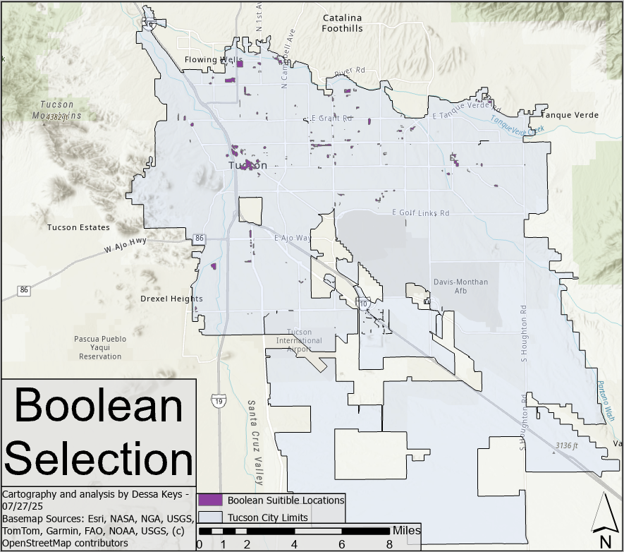{.lightbox fig-align="center"}

  

[**Ranked Suitability Analysis**]{style="font-size: 18px;"}

  

This analysis identified very little area as "Highly Suitable" and most of it was in the downtown area. There was also a small section in the northside. There were a few other areas identified as suitable with most of that also being in the downtown area and a few other sections dispersed throught the core of the city.

  

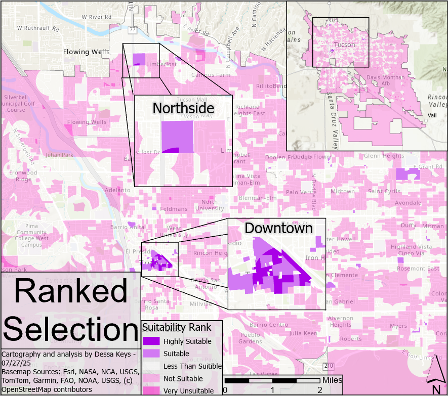{.lightbox fig-align="center"}

  

```{=html}
<h3 style="margin-top:1em;">Conclusion</h3>
```

  

Both analysis have selected the downtown area as an optimal area for development of high density housing. For those familiar with Tucson, this may seem counter intuitive as the downtown area is densely packed with buildings many of those being multiple story and high-rise buildings. Unfortunately, very few of those densely packed buildings actually have permanent residents. Since the downtown area is zoned for mixed use and has lots of access to public transportation as well as proximity to a market, it is a definitely a good candidate area. However, the downtown area is highly developed already with commercial and office buildings. Areas further from the city's core may be better suited for development due to costs.

  

While both methodologies identified similar areas in the downtown region and the northside, the Boolean analysis provided many more options. This would provide more flexibility which may be a better choice for interested stakeholders. However, due to the nature of the variables, neither analysis may be ideal on their own due to the limitations of the processes used.

  

Boolean analysis can not provide preference between areas simply zoned as high density residential and those zoned as mixed use high density residential and commercial. Because of the desire to develop both high density housing and provide an opportunity for more commercial development (as in the Community Corridors Tool), ideal analysis gives a preference to mixed use over simply high density residential but we don't want to exclude either. The ranked method does have it's flaw in that evaluation as well though, as areas not zoned for that development must still be included in the analysis whereas the Boolean method would exclude these areas. Because of the short distances involved in the grocery store and public transport stop requirements, a ranked selection is not ideal as we simply want to know if they are withing the maximum allowable distance. Analysis that includes both boolean and ranked choice principles would be idea.

  

An additional limitation is that the distances are calculated as straight line paths from the target location. Unfortunately in most cases, a person will not be able to travel in a straight line and will need to do so on a walking paths network. In Tucson not all roads have sidewalks so a walking paths network analysis should be included to more accurately model distances and walking times for residents. An additional option may be to include bike a bike path network analysis. These have the potential to drastically change the outcomes of both kinds of analysis.

  

Finally, this analysis would benefit from the inclusion of other variables not considered for the scope of this project. Inclusion of a development/undeveloped attribute would be beneficial as developing currently undeveloped land would be the best. Property values would also be worth considering in an attempt to minimize expenses.

```{=html}
<h3 style="margin-top:1em;">References</h3>
```

  

“ARTICLE 4: ZONES.” American Legal Publishing, 4 June 2025, codelibrary.amlegal.com/codes/tucson/latest/tucson_az_udc/0-0-0-1785. Accessed 1 Aug. 2025.

  

“Community Corridors Tool.” Tucsonaz.gov, 2025, corridors.tucsonaz.gov/.

  

“Original City Zoning - Open Data.” Tucsonaz.gov, 18 Oct. 2023, gisdata.tucsonaz.gov/datasets/cotgis::original-city-zoning-open-data/about. Accessed 1 Aug. 2025.

  

Robbins, Natalie. “Tucson Needs 35k Housing Units to Meet Demand; Officials Hope Community Corridors Tool Is a Solution.” Tucsonsentinel.com, 20 Mar. 2025, www.tucsonsentinel.com/local/report/032025_cct_zoning/tucson-needs-35k-housing-units-meet-demand-officials-hope-community-corridors-tool-solution/, http://www.tucsonsentinel.com/local/report/032025_cct_zoning/tucson-needs-35k-housing-units-meet-demand-officials-hope-community-corridors-tool-solution/. Accessed 1 Aug. 2025.

  

### Point Pattern Analysis

```{=html}
<h2 style="margin-top:1em;">Determining Spatial Randomness of Plant Samples</h2>
```

  

```{=html}
<h3 style="margin-top:1em;">Problelm Statement</h3>
```

  

The California Vegetation Classification and Mapping Program (VegCAMP) seeks to establish a map of California's vegetation at a high resolution. VegCAMP does not have a standard for sample site allocation. Sampling sites are a combination of sites allocated ahead of time and sites of opportunity. For allocating sample sites, it has employed Generalized Random Tessellation Stratified (GTRS) survey design and a gradient-directed transect (gradsect) approach. The Generalized Random Tesselation Stratified survey design aims to spatially balance sample sites. (VegCAMP Background)

  

$H_0$: The sampling sites are completely spatially random

  
While complete spatial randomness is not required for spatially balanced sampling, it does seek to avoid clustering. This analysis seeks to answer the question of whether these sampling sites are randomly distributed or not. 

  

```{=html}
<h3 style="margin-top:1em;">Data</h3>
```

  

This study area is a roughly 30 square kilometer, rectangular area, that encompasses Mount Tamalpais, a portion of Mount Tamalpais state park, as well as most of Muir Woods National Monument. These features utilized are located on the northern peninsula of the San Francisco Bay in Northern California which is located across the Golden Gate Strait from the City and County of San Francisco. It is a point feature class with attribute information regarding the plants sampled and various other information such as methodologies used. The only attribute used for this analysis is location. The point feature was clipped to the study area.

  

The dataset used for this analysis is the [Vegetation Survey Points - CDFW \[ds1020\]](https://gis.data.ca.gov/maps/b3e92f99881b4b03bab0ef8d74c229e9/about) downloaded from the State of California's State Geoportal. This dataset is published by the California Department of Fish and Wildlife. It is a point feature class.

  

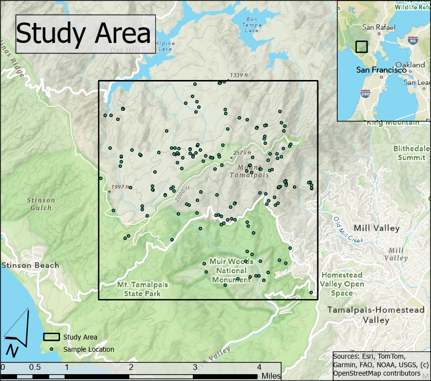{.lightbox fig-align="center"}

  

```{=html}
<h3 style="margin-top:1em;">Methods</h3>
```

  

These analyses use a Natural Earth projection which is compromised of a pseudocylindrical projection. This was done to quickly and easily mimic a Cartesian plane with no need for tweaking parameters. However, because this is a compromise pseudocylindrical projection, distances are distorted. A conformal projection with parameters tweaked to mimic a Cartesian plane would be ideal.

  

There are 168 total sample points within the study area. Each point represents an area of varying sizes where the alliance-level foliage was cataloged. There are also additional attributes describing various aspects like land ownership, soil types, and sampling method employed. (VegCAMP Background)

  

Extent
Top:	4,270,318.040700m
Bottom	4,264,818.105300m
Left	-11,061,612.331300m
Right	-11,056,112.395900m

  

This extent was chosen because it was an area with a moderate apparent density of points and did not include spatial interruptions like bodies of water or developed land that might affect the outcomes. To make the quadrat count as simple as possible, a square study area was used.

  
[**Quadrat Count**]{style="font-size: 18px;"}

  

The quadrat count method is a density-based measure. This method divides the study area into a gird and then counts the number of points in each quadrat. The Variance-Mean Ratio (VMR) is then calculated. If a VMR is near 1, then the points are spatially random. As the VMR becomes increasingly less than 1, it is tending more towards being dispersed. As the VMR becomes increasingly larger than 1, the points are increasingly tending towards clustering.

  

[**Average Nearest Neighbor**]{style="font-size: 18px;"}

  

This is a distance-based calculation. This process begins by measuring the distances between points and their nearest neighbor and then averages the distance. This is then compared to the result from a random distribution. With a random distribution once again having a value of one, the directionality is reversed from the quadrat count. In this case as the Average Nearest Neighbor (ANN) becomes increasingly less than 1, the pattern is tending more towards clustering and visa versa. The output of the ANN Spatial Statistics Tool includes statistical tests for significance.

  

[**Ripley's K**]{style="font-size: 18px;"}

  

Ripley's K is another distance-based calculation that evaluates multiple times over varying distances. The tool outputs a graph with the expected output across the  set of permutations for complete spatial randomness as well as the observed output across those permutations. If specified, it includes a confidence interval. If the observed values fall *outside* the confidence values, then the null hypothesis can be rejected.

  

[**Assumptions**]{style="font-size: 18px;"}

  

The study area was divided into 10 rows and 10 columns. This created 100 square quadrats of equal size comprised of 0.3 square kilometers each. Establishing quadrats of equal size was important to avoid bias from varying sizes having more or less opportunity to contain points. For the distance-based methods, it is assumed that the nearest neighbor lies within the study-area. This is the result of establishing a study area as not all points can be included. The Ripley's K tool was set to do 999 permutations —to establish reliable confidence intervals— of 10 bands with 300 meter increments in an attempt to achieve approximately a maximum distance of about 10% the length of the study area.

  

```{=html}
<h3 style="margin-top:1em;">Results</h3>
```

  

[**Quadrat Count**]{style="font-size: 18px;"}

  

While the sampling points may seem fairly well distributed visually, when summing the points in each quadrat, 40% of them do not have a single point in them and another ~20% only have one point in them (Figure 1). After performing the calculations for the Variance Mean Ratio, a VMR of ~2.8 was returned. This is larger than 1 which means the points are clustered (Figure 2).

  

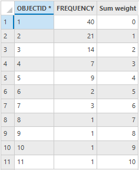{.lightbox fig-align="center"}

  

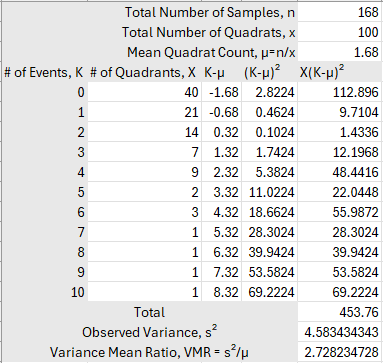{.lightbox fig-align="center"}

  

[**Average Nearest Neighbor**]{style="font-size: 18px;"}

  

The average nearest neighbor returned a ratio of ~0.63 which is less than 1, implying that it is clustered. A value larger than 1 would have implied the points were dispersed. It returned a z-value of ~-9.1. This value implies the points are highly clustered. The analysis also returns a p-value of ~0.0 which makes the result highly statistically significant (Figure 3). With the three of these values, the null hypothesis can be rejected.

  

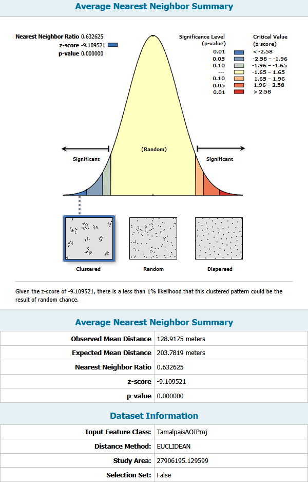{.lightbox fig-align="center"}

  

[**Ripley's K**]{style="font-size: 18px;"}

  

Over the 10 distance bands of 300 meter increments, the observed K value were consistently above the upper confidence envelope. However, both the Observed K values and the Upper confidence envelope values drop below the Expected K (Figure 4). This is likely a result of edge effects since no edge correction was used and the larger distance values extend well beyond the edge of the study area when conducting the analysis.

  

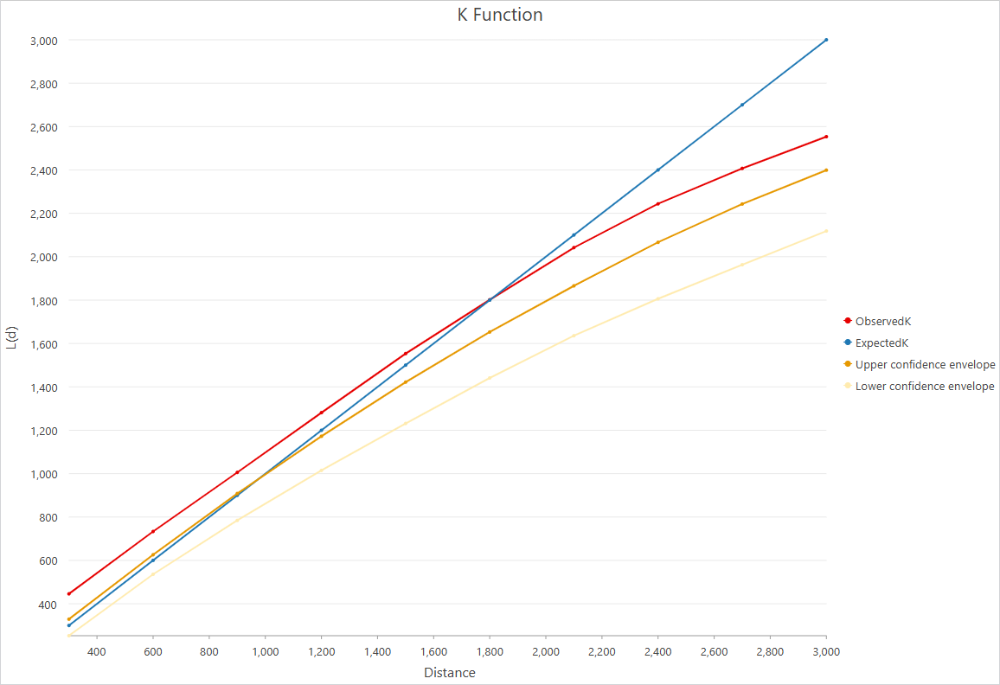{.lightbox fig-align="center"}

  

```{=html}
<h3 style="margin-top:1em;">Conclusions</h3>
```

  

While trying to spatially balance sampling sites is not the same as having a randomly distributed set of sample sites, the fact that all three analyses indicate there is significant clustering and the null hypothesis has been rejected means that the sites are not actually spatially balanced either. There may not have been any intent to spatially balance the sampling sites or there were enough "sites of opportunity" that were not allocated in a spatially balanced plan that the result is these sites are significantly clustered.

  

In this analysis, the ANN was the only method where a test for significance was applied but the result was extremely statistically significant clustering. The Ripley
's K had odd behavior with the Upper confidence limit dropping below the expected values which adds some doubt to the results of that method but combined with the other two, the Null Hypothesis has been thoroughly rejected.

  

The limitations of these analysis are that they are very shape dependent. The density values can only correctly be calculated if the shapes are homogeneous in shape and area. Meanwhile the distance based methods have edge-effect issues that vary with the shape of the study area. As mentioned above, the Ripley's K was not calculated with edge correction, but even the edge correction is an interpolation that is not strictly representative of the data within the study area.

  

```{=html}
<h3 style="margin-top:1em;">References</h3>
```

  

“How Average Nearest Neighbor Works—ArcGIS pro | Documentation.” Pro.arcgis.com, pro.arcgis.com/en/pro-app/latest/tool-reference/spatial-statistics/h-how-average-nearest-neighbor-distance-spatial-st.htm. Accessed 8 Aug. 2025.
  
“Multi-Distance Spatial Cluster Analysis (Ripley’s K Function) (Spatial Statistics)—ArcGIS pro | Documentation.” Pro.arcgis.com, pro.arcgis.com/en/pro-app/latest/tool-reference/spatial-statistics/multi-distance-spatial-cluster-analysis.htm. Accessed 8 Aug. 2025.
  
“VegCAMP Background.” Wildlife.ca.gov, wildlife.ca.gov/Data/VegCAMP/Background. Accessed 8 Aug. 2025.
  
“Vegetation Survey Points - CDFW [Ds1020].” Ca.gov, 2020, gis.data.ca.gov/maps/b3e92f99881b4b03bab0ef8d74c229e9/about. Accessed 8 Aug. 2025.

  

### Spatial Regression


```{=html}
<h2 style="margin-top:1em;">Street Tree Canopy Equity in Portland Oregon</h2>
```

  

```{=html}
<h3 style="margin-top:1em;">Problem Statement</h3>
```

  

Despite it's recent disappearance from government websites such as EPA.gov, the issue of tree canopy disparity has been well established by numerous studies such as (McDonald, et. al 2021). As quantified in that study, there is often significantly less tree canopy coverage in low income areas versus their wealthier counterparts. There are also disparities between those neighborhoods primarily comprised of ethnic minorities and those of predominantly white residents. This in turn has an impact on the health of residents as well as intensifying the heat island effect in areas with low tree canopy. This analyses seeks to determine if the tree canopy coverage in the City of Portland, Oregon is equitably distributed.

  

```{=html}
<h3 style="margin-top:1em;">Data</h3>
```

  

The study area for this analysis is the city limits of Portland, Oregon. Portland is located along the Columbia and Willmette Rivers. It is located on the northern border of Oregon across the Columbia River from Vancouver Washington.

  

The data for this analysis consists of the ["Street Tree Inventory - Ative Records"](https://gis-pdx.opendata.arcgis.com/datasets/PDX::street-tree-inventory-active-records/about) dataset downloaded from the PortlandMaps - Open Data site. It also includes the Portland City Limits feature extracted from the ["City Boundries"](https://gis-pdx.opendata.arcgis.com/datasets/PDX::city-boundaries/about) dataset also downloaded from the PortlandMaps - Open Data site. Two Census datasets were downloaded from the ArcGIS Online Portal, the ["USA 2020 Census Population Characteristics"](https://www.arcgis.com/home/item.html?id=ebeb65deb5c14f4d8849fd68944b7ee6) —which contains demographic information— and the ["USA Esri Demographics (Latest)](https://www.arcgis.com/home/item.html?id=8f6b71915a144f60a3a6ca72b57cdb56) layer —which contains income information.

  

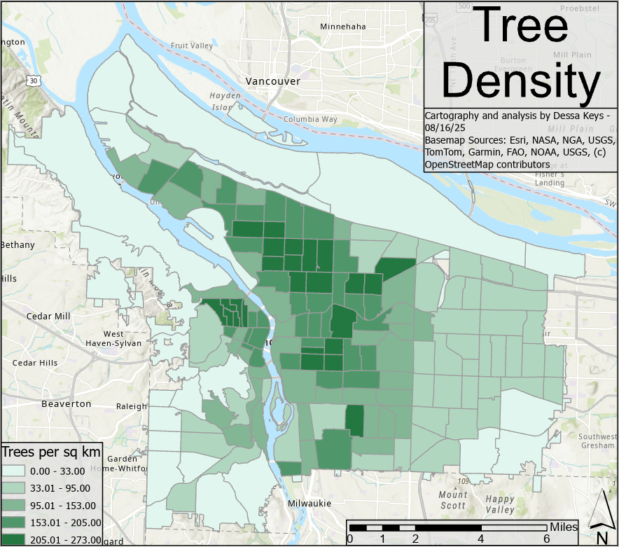{.lightbox fig-align="center"}

  

```{=html}
<h3 style="margin-top:1em;">Methods</h3>
```

  

There were minimal demands for this analysis in determining a projection. Because we are attempting to sum the amounts of points in a polygon, and are calculations have already been predetermined, the only need is for accuracy of shape. Thus, the Oregon State Plane North projection was used which is Lambert conformal conic. The 2011 update to the 1983 North American Datum was used as the datum.

  

The outcome we are interested in is tree density therefore trees per square kilometer is the dependent variable. In order to establish this variable trees within each census tract were summed and then divided by the area of the census tract. Explanatory variables utilized in exploratory analysis included Population Density (P001_calc_pctPopDensity), Percent of population who is white (P005_calc_pct0003), Ratio of males to females (P012_calc_pctRatio),  Median age of total population (P0130001), Median Household Income (MEDHINC_CY), and Median Home Value (MEDVAL_CY). Variables that were obviously colinear were not included e.g. Median age of total population was included but percent of population over 65 was not. 

  

[**Exploratory Regression Analysis**]{style="font-size: 18px;"}

  

The exploratory regression analysis iterates though all possible combinations of explanatory variables from a given minimum count of variables to a given maximum count. Each iteration evaluates an ordinary least squares model. The Exploratory Regression Analysis Geoprocessing tool in ArcGIS Pro allows the user to specify criteria that a model must meet in order to pass. These include a minimum Adjusted R Squared which evaluates the model fit, minimum Jaque Bera p value for evaluating the residuals and a minimum acceptable Spatial Autocorrelation p value for determining the acceptable similarity of nearby values. (Figure 1).

  

Ordinary Least Squares (OLS) regression analysis works by estimating the relationship between the dependent variable and explanatory variable(s) by finding the coefficiants of the explanatory variables that minimize the sum of the squared residuals. The residuals are the difference between the observed value and the predicted value. The OLS Spatial Statistics tool provides additional statistical calculations in a diagnostic table that help evaluate the performance of the model (Figure 2).

  

[**Geographically Weighted Regression Analysis**]{style="font-size: 18px;"}

  

Geographically Weighted Regression (GWR) analysis is similar to OLS in that it attempts to establish coefficients for each of the explanatory variables. It differs however in that it accounts for nonstationarity of those relationships across the study area. It accomplishes this using regression equations for each feature using nearby features that result in different coefficients for the explanatory variables across the study area.

  

In the exploratory Regression tool, the defaults were left on the Search Criteria with the exception of Maximum Number of Explanatory Variables which were set to the same as the total number of explanatory variables selected. This was done because at 7 variables, the number of variables was still small but gave the opportunity to include all variables should they all have been significant. (Figure 1) Default values were used for the remaining tools.

  

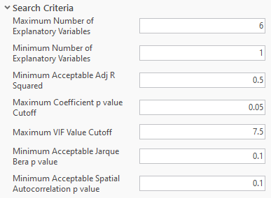{.lightbox fig-align="center"}

  


```{=html}
<h3 style="margin-top:1em;">Results</h3>
```

  

[**Exploratory Regression Analysis**]{style="font-size: 18px;"}

  

None of the models pass the statistical requirements set in the Exploratory Regression tool's Search Criteria. This is because all of the Adjusted R-Squared values are below the 0.5 criteria. This has resulted in 7 models that explain the same amount of correlation with an Adjusted R-Squared of 0.39. Of those, the most explanatory variables included that are statistically significant is 3. This helps narrow the models down to ones that include 3 variables. Of those the only one with all three variables statistically significant also has the lowest AICc of 2118.85. This makes it the best model though it is a weak model. (Figure 2)

  

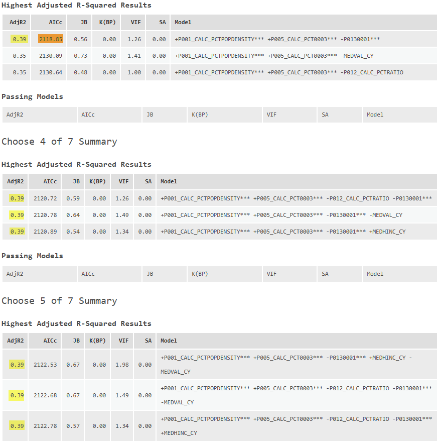{.lightbox fig-align="center"}

  

After running the OLS on that model, there are further diagnostic statistics available. The coefficients (Green) for population density (P001_CALC_PCT0003) indicates that there is a small positive relationship.  Percentage of white residents (P005_CALC_PCT0003) has a larger positive relationship. And finally, the median age (P0130001) has a large negative correlation. The probability for all three (Yellow) is highly significant. The values for the Variance Inflation Factors (VIF) for all three variables are slightly larger than one which indicates there is not much redundancy in the variables. The Koenker Statistic was significant indicating the data are nonstationary. Finally, the ~0.56 probability for the Jarque-Bera Statistic means we can not definitively determine if the residuals are normally distributed.

  

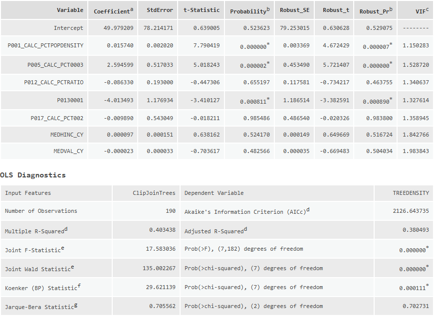{.lightbox fig-align="center"}

  

After identifying 3 explanatory variables from the exploratory analysis, an OLS regression can be run to get diagnostic statistics not included in the exploratory analysis output table. After running the OLS regression, a Koenker Statistic has a significant p-value which means the relationship is nonstationary or heteroskedatic. (Figure 3) To confirm this we can run a Moran's I calculation which gives a result of ~0.48 which implies positive spatial autocorrelation. The p-value is ~0.0 which means this result is very statistically significant. (Figure 4) Running the Spatial Autocorrelation (Global Moran's I) Spatial Statistics Tool, a probability of ~0.0 and a positive value of~0.48  means that the data is spatially autocorrelated and clustered (Figure 5)

  

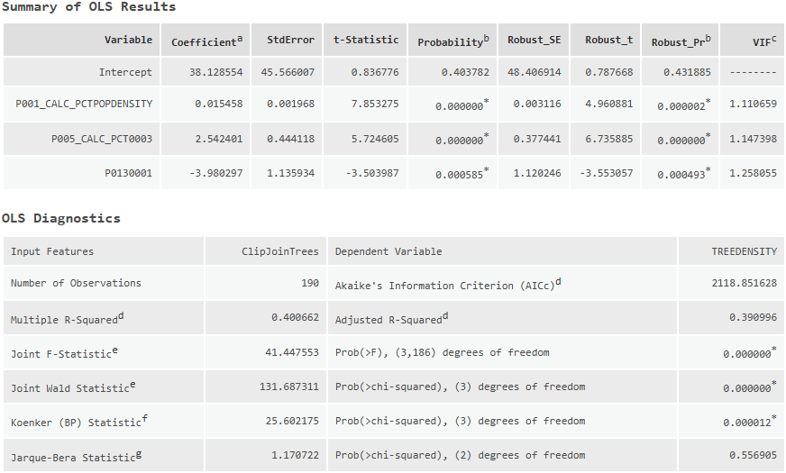{.lightbox fig-align="center"}

  

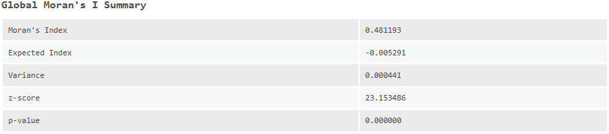{.lightbox fig-align="center"}

  

[**Geographically Weighted Regression Analysis**]{style="font-size: 18px;"}

  

The Adjusted R-Squared for the GWR model is ~0.86 which is more than double what it was for the OLS model. The AICc of this model is also much lower than the OLS at ~1889.27 versus 2118.85. This also indicates that the GWR model is much better. With no other GWR models to compare to the Sigma-Squared and Sigma-Squared MLE do not give us much additional information. (Figure 6)

  

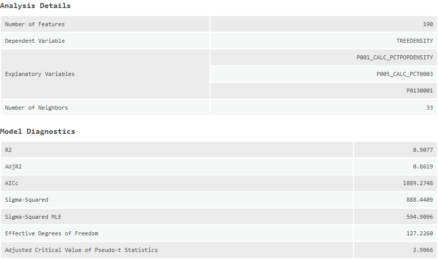{.lightbox fig-align="center"}
  
The Median Age results map shows that there are two regions of strong positive correlation (Purple) which means there is more tree canopy cover and a higher median age in those areas. Interestingly there are also som regions in the southwest of the city were the tree canopy decreases where there is a higher median age. (Dark Green)
 
   
 
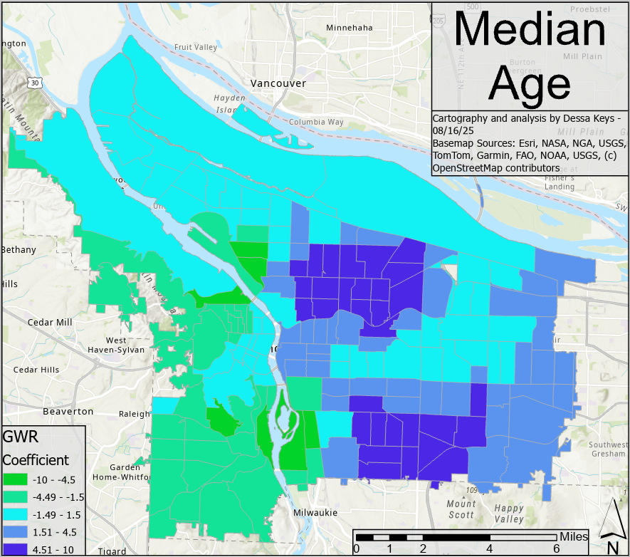{.lightbox fig-align="center"}

  

There is a core through the center of the city where there is a positive correlation between the percent of the population that is white and the density of tree canopy. This effect is particularly strong in the south central part of the city (Dark Purple). There are minimal areas where this effect is inverted.

  

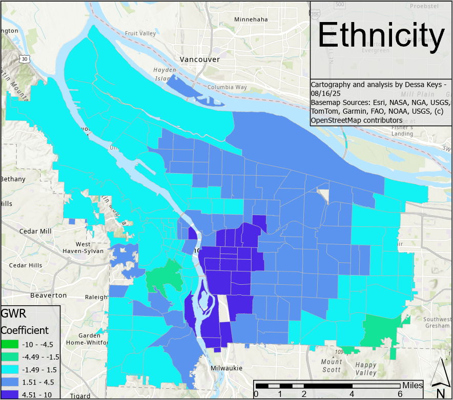{.lightbox fig-align="center"}

  

```{=html}
<h3 style="margin-top:1em;">Conclusion</h3>
```

  

This analysis shows that the City of Portland does have opportunity for improvement for tree canopy equity but surprisingly the city is fairly equitable between income groups. There was however still racial disparity with a strong correlation through much of the city where census tracts that consisted of a higher percentage of white residents had more tree canopy. Perhaps the most surprising finding though was the some of the strongest correlation was with the median age of the Census Tract.

  

The GWR was a far superior model as evidenced by nearly every statistical measure. The effect could also be seen visually on the maps as the clustering is very evident. While the effect of the density of population was significant in the results. The strength of the correlation was minimal in both the OLS and GWR.

There were several limitations in this analysis that could possible be overcome with more data or the addition of other datasets and analysis. One limitation is that the method used for normalization of the tree distributions was density by area of the census tract, however, the trees being measured are along the street network so it is possible that there are areas where the total area may be larger but the total linear street networn within that Census tract is lower than others and visa versa and this would introduce bias. An analysis normalizing thre tree data as trees per kilometer of road network in the census tract would probably improve results.

  

```{=html}
<h3 style="margin-top:1em;">References</h3>
```

  

“City Boundaries.” Arcgis.com, 4 Aug. 2025, gis-pdx.opendata.arcgis.com/datasets/PDX::city-boundaries/about. Accessed 15 Aug. 2025.
  
McDonald, Robert I., et al. “The Tree Cover and Temperature Disparity in US Urbanized Areas: Quantifying the Association with Income across 5,723 Communities.” PLOS One, vol. 16, no. 4, 28 Apr. 2021, https://doi.org/10.1371/journal.pone.0249715.
  
“Median Household Incoe 2025 - Esri Demographics.” Arcgis.com, 23 July 2025, www.arcgis.com/home/item.html?id=04b1d8c01fdd4920b52dc227dc42f186. Accessed 15 Aug. 2025.
  
“Street Tree Inventory - Active Records.” Arcgis.com, 23 Jan. 2025, gis-pdx.opendata.arcgis.com/datasets/PDX::street-tree-inventory-active-records/about. Accessed 15 Aug. 2025.
  
“USA 2020 Census Population Characteristics.” Arcgis.com, 9 July 2025, www.arcgis.com/home/item.html?id=ebeb65deb5c14f4d8849fd68944b7ee6. Accessed 15 Aug. 2025.
  
“USA Esri Demographics (Latest).” Arcgis.com, 2025, www.arcgis.com/home/item.html?id=8f6b71915a144f60a3a6ca72b57cdb56. Accessed 15 Aug. 2025.
  

:::
# Tucson Drainage Basin

## Objective

The dry rivers and washes of the Tucson area often fill at incredible speed even when rainfall is limited to portions of the Tucson area at great distances away from the point of observation. This is very likely due to the contributing drainage features comprising a large drainage basin. This project seeks to determine how large the drainage basin is for runoff in the Tucson area.

[**Data**]{style="font-size: 24px;"}

The area used to determine the location of the drainage point will comprise Tucson, Arizona and surrounding suburbs.
The analysis uses Shuttle Radar Topography Mission (SRTM) raster data, which comprise Digital Elevation Models (DEMs).

Name of dataset: Shuttle Radar Topography Mission Void Filled<br>
Publication date: 2012/10/01<br>
Date updated: 2025/03/10<br>
Owner: US Geological Survey (USGS) Earth Resources Observation & Science (EROS)<br>
[Click here to go to the repository](https://earthexplorer.usgs.gov/)<br>
Spatial Reference:<br>
Geographic Coordinate System: WGS 1984<br>
Projection: Not projected<br>
Horizontal datum: D WGS 1984<br>
WKID: 4326<br>
Data Type: raster<br>

[**Pre-processing**]{style="font-size: 18px;"}


[**Elevation of Tucson Area**]{style="font-size: 18px;"}

After SRTM rasters were merged, they were projected to the Arizona State Plane Coordinate System and clipped to the area of interest to create a Digital Elevation Model (DEM) of the Tucson area.

{.lightbox fig-align="center"}

[**Flow Direction**]{style="font-size: 18px;"}

After establishing a DEM, flow direction can be determined.

{.lightbox fig-align="center"}

[**Sinks**]{style="font-size: 18px;"}

Flow direction can then be used to identify sinks. These sinks must be filled to determine drainage features.

{.lightbox fig-align="center"}

[**Flow Accumulation**]{style="font-size: 18px;"}

Since the sinks are now filled, flow direction is redetermined and then used to calculate flow accumulation.
{.lightbox fig-align="center"}

[**Drainage Features**]{style="font-size: 18px;"}

In a seperate process, using just the original DEM, drainage features can be determined. The Sthalar method was used for this step to determine drainage feature order. This allows for better visualization of the major drainage features than can be seen in the flow accumulation raster.

{.lightbox fig-align="center"}

[**Tucson Area Watersheds**]{style="font-size: 18px;"}

Using a calculation that extracts streams and larger drainage feature that have at least 125,000 cells of accumulated flow along with using the flow accumulation, the watersheds for the Tucson area are then calculated.

{.lightbox fig-align="center"}

[**Complete Drainage Basin**]{style="font-size: 18px;"}

While the original intent was to visualize the watersheds in the Tucson area, the watersheds of the drainage point extend beyond the area of interest. Using the original merged SRTM DEM, the calculations can be used again to capture the entire drainage basin for the drainage point and visualized using a smaller scale.

{.lightbox fig-align="center"}

[**ArcGIS Pro Model**]{style="font-size: 18px;"}

The below model represents the workflow used to create the above maps.

{.lightbox fig-align="center"}

[**Sources**]{style="font-size: 18px;"}

U.S. Geological Survey. (2000). Shuttle Radar Topography Mission (SRTM) 1 Arc-Second Global. Retrieved July 1, 2025, from USGS EarthExplorer: https://earthexplorer.usgs.gov/

Esri. (2025). World Topographic Map [Basemap]. Sources: Esri, HERE, Garmin, FAO, NOAA, USGS, © OpenStreetMap contributors, and the GIS user community. Retrieved from https://www.arcgis.com

# ISTA498-Capstone

[**Project Radiance: Group Capstone Project for the University of Arizona ISTA 498**]{style="font-size: 24px;"} <br>\
[**Team Members:**]{style="font-size: 20px;"}

-   Nate Cutler (Project Manager, [Germany](https://github.com/dessak/ISTA498-Capstone/tree/main/src/tools/germany), [PowerBI Visualizations](https://github.com/dessak/ISTA498-Capstone/tree/main/src/vizualizations))

-   Dessa Keys ([US](https://github.com/dessak/ISTA498-Capstone/tree/main/US), [Tableau Dashboard](https://public.tableau.com/app/profile/dessa2111/viz/ProjectRadiance/Map))

-   Juan Flores ([Japan](https://github.com/dessak/ISTA498-Capstone/tree/main/src/tools/japan), [Poster Design](https://github.com/dessak/ISTA498-Capstone/blob/main/src/vizualizations/ISTA_498_Group_5_Final_Poster.png))

-   Michael Lord ([UK](https://github.com/dessak/ISTA498-Capstone/tree/main/UK))

This project was conceptualized by Nate Cutler as the capstone project for the team and presented in December 2023. It is intended to highlight various skills learned for the Information Science degree from the University of Arizona's iSchool and therefore employs various methods and languages.

Data Sources

-   US: Environmental Protection Agency's RadNet

-   Germany: Bundesamt fur Strahlenschutz

-   Japan: Database for Radioactive Substance Monitoring Data

-   UK: Department for Energy Security and Net Zero

[Project Poster]{style="font-size: 24px;"}


# Tucson Weather
[**Analysing Historic Tucson Weather Data**]{style="font-size: 24px;"}  
<br>
[This repository](https://github.com/dessak/TucsonWeather/tree/main) contains various explorations of historic weather data for Tucson, Arizona pulled from NOAA's Climate Data Online (CDO)

[**Relevant Links**]{style="font-size: 24px;"}  
  
Data Source:  
[https://www.ncei.noaa.gov/access/services/data/v1](https://www.ncei.noaa.gov/access/services/data/v1) (HTTP 1.1 GET request endpoint)

Request Endpoint Parameters:  
[https://www.ncei.noaa.gov/support/access-data-service-api-user-documentation](https://www.ncei.noaa.gov/support/access-data-service-api-user-documentation)

[**Station List:**]{style="font-size: 24px;"}  
  
        'US1AZPM0003', 'US1AZPM0004', 'US1AZPM0005', 'US1AZPM0007', 'US1AZPM0010', 'US1AZPM0014', 'US1AZPM0019',
        'US1AZPM0024', 'US1AZPM0031', 'US1AZPM0044', 'US1AZPM0050', 'US1AZPM0051', 'US1AZPM0054', 'US1AZPM0072',
        'US1AZPM0082', 'US1AZPM0087', 'US1AZPM0093', 'US1AZPM0099', 'US1AZPM0103', 'US1AZPM0104', 'US1AZPM0106',
        'US1AZPM0107', 'US1AZPM0108', 'US1AZPM0111', 'US1AZPM0114', 'US1AZPM0118', 'US1AZPM0119', 'US1AZPM0122',
        'US1AZPM0124', 'US1AZPM0125', 'US1AZPM0132', 'US1AZPM0135', 'US1AZPM0142', 'US1AZPM0143', 'US1AZPM0145',
        'US1AZPM0146', 'US1AZPM0147', 'US1AZPM0148', 'US1AZPM0149', 'US1AZPM0156', 'US1AZPM0160', 'US1AZPM0173',
        'US1AZPM0174', 'US1AZPM0181', 'US1AZPM0184', 'US1AZPM0193', 'US1AZPM0198', 'US1AZPM0199', 'US1AZPM0201',
        'US1AZPM0202', 'US1AZPM0206', 'US1AZPM0208', 'US1AZPM0210', 'US1AZPM0214', 'US1AZPM0215', 'US1AZPM0218',
        'US1AZPM0229', 'US1AZPM0233', 'US1AZPM0244', 'US1AZPM0245', 'US1AZPM0247', 'US1AZPM0248', 'US1AZPM0249',
        'US1AZPM0254', 'US1AZPM0261', 'US1AZPM0263', 'US1AZPM0265', 'US1AZPM0268', 'US1AZPM0273', 'US1AZPM0292',
        'US1AZPM0294', 'US1AZPM0301', 'US1AZPM0304', 'US1AZPM0306', 'US1AZPM0315', 'US1AZPM0321', 'US1AZPM0328',
        'US1AZPM0336', 'US1AZPM0338', 'US1AZPM0339', 'US1AZPM0340', 'US1AZPM0355', 'US1AZPM0356', 'US1AZPM0362',
        'US1AZPM0363', 'US1AZPM0366', 'US1AZPM0370', 'US1AZPM0371', 'US1AZPM0373', 'US1AZPM0374', 'US1AZPM0379',
        'US1AZPM0384', 'US1AZPM0386', 'US1AZPM0391', 'US1AZPM0399', 'US1AZPM0405', 'US1AZPM0409', 'US1AZPM0411',
        'US1AZPM0412', 'US1AZPM0415', 'US1AZPM0416', 'US1AZPM0422', 'US1AZPM0424', 'US1AZPM0426', 'US1AZPM0427',
        'US1AZPM0433', 'US1AZPM0436', 'US1AZPM0441', 'US1AZPM0442', 'US1AZPM0443', 'US1AZPM0446', 'US1AZPM0449',
        'US1AZPM0450', 'US1AZPM0460', 'US1AZPM0463', 'US1AZPM0470', 'USC00028795', 'USC00028796', 'USC00028799',
        'USC00028800', 'USC00028810', 'USC00028815', 'USC00028817', 'USW00023160', 'USW00053131'

[**Parameters Included in Request:**]{style="font-size: 24px;"}  
  
        'ACMH', 'ACSH', 'ADPT', 'ASLP', 'ASTP', 'AWBT', 'AWND', 'DAEV', 'DAPR', 'DAWM', 'EVAP', 'FMTM', 'FRGT',
        'MDEV', 'MDPR', 'MDWM', 'MNPN', 'MXPN', 'PGTM', 'PRCP', 'PSUN', 'RHAV', 'RHMN', 'RHMX', 'SNOW', 'SNWD',
        'TAVG', 'THIC', 'TMAX', 'TMIN', 'TOBS', 'TSUN', 'WDF1', 'WDF2', 'WDF5', 'WDFG', 'WDFM', 'WDMV', 'WESD',
        'WESF', 'WSF1', 'WSF2', 'WSF5', 'WSFG', 'WSFM', 'WT01', 'WT02', 'WT03', 'WT04', 'WT05', 'WT06', 'WT07',
        'WT08', 'WT09', 'WT10', 'WT11', 'WT13', 'WT14', 'WT16', 'WT18', 'WT19', 'WT21', 'WT22', 'WV03'

[**Tucson Historical Maximum and Minimum Temperature Differences From Average**]{style="font-size: 20px;"}


